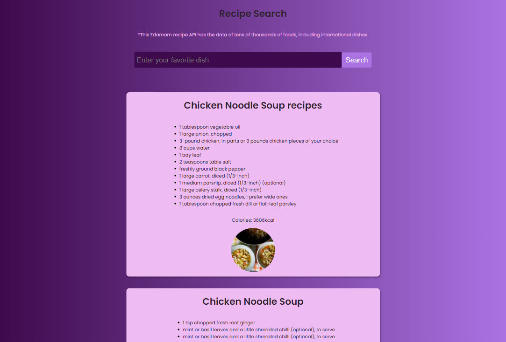

# Recipe Search Website

#### The aim of this project is to practice ReactJS and API fetching practice.

#### This Edamam recipe API has the data of tens of thousands of foods, including international dishes.

> - React.js, Hooks, JavaScript 
> - Components, props, css
> - Asynchronous API (async/await)

### `npm start`

Runs the app in the development mode.\
Open [http://localhost:3000](http://localhost:3000) to view it in your browser.

The page will reload when you make changes.\
You may also see any lint errors in the console.

